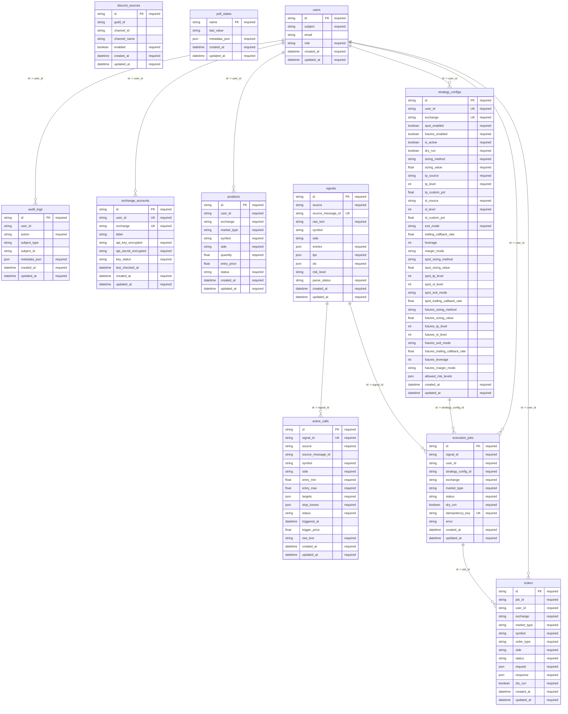

# Cryptobot Database Schema

```mermaid
erDiagram
  active_calls {
    string id PK "required"
    string signal_id UK "required"
    string source "required"
    string source_message_id
    string symbol "required"
    string side "required"
    float entry_min "required"
    float entry_max "required"
    json targets "required"
    json stop_losses "required"
    string status "required"
    datetime triggered_at
    float trigger_price
    string raw_text "required"
    datetime created_at "required"
    datetime updated_at "required"
  }
  audit_logs {
    string id PK "required"
    string user_id
    string action "required"
    string subject_type
    string subject_id
    json metadata_json "required"
    datetime created_at "required"
    datetime updated_at "required"
  }
  discord_sources {
    string id PK "required"
    string guild_id
    string channel_id
    string channel_name
    boolean enabled "required"
    datetime created_at "required"
    datetime updated_at "required"
  }
  exchange_accounts {
    string id PK "required"
    string user_id UK "required"
    string exchange UK "required"
    string label
    string api_key_encrypted "required"
    string api_secret_encrypted "required"
    string key_status "required"
    datetime last_checked_at
    datetime created_at "required"
    datetime updated_at "required"
  }
  execution_jobs {
    string id PK "required"
    string signal_id "required"
    string user_id "required"
    string strategy_config_id "required"
    string exchange "required"
    string market_type "required"
    string status "required"
    boolean dry_run "required"
    string idempotency_key UK "required"
    string error
    datetime created_at "required"
    datetime updated_at "required"
  }
  orders {
    string id PK "required"
    string job_id "required"
    string user_id "required"
    string exchange "required"
    string market_type "required"
    string symbol "required"
    string order_type "required"
    string side "required"
    string status "required"
    json request "required"
    json response "required"
    boolean dry_run "required"
    datetime created_at "required"
    datetime updated_at "required"
  }
  poll_states {
    string name PK "required"
    string last_value
    json metadata_json "required"
    datetime created_at "required"
    datetime updated_at "required"
  }
  positions {
    string id PK "required"
    string user_id "required"
    string exchange "required"
    string market_type "required"
    string symbol "required"
    string side "required"
    float quantity "required"
    float entry_price
    string status "required"
    datetime created_at "required"
    datetime updated_at "required"
  }
  signals {
    string id PK "required"
    string source "required"
    string source_message_id UK
    string raw_text "required"
    string symbol
    string side
    json entries "required"
    json tps "required"
    json sls "required"
    string risk_level
    string parse_status "required"
    datetime created_at "required"
    datetime updated_at "required"
  }
  strategy_configs {
    string id PK "required"
    string user_id UK "required"
    string exchange UK "required"
    boolean spot_enabled "required"
    boolean futures_enabled "required"
    boolean is_active "required"
    boolean dry_run "required"
    string sizing_method "required"
    float sizing_value "required"
    string tp_source "required"
    int tp_level "required"
    float tp_custom_pct
    string sl_source "required"
    int sl_level "required"
    float sl_custom_pct
    string exit_mode "required"
    float trailing_callback_rate
    int leverage
    string margin_mode
    string spot_sizing_method
    float spot_sizing_value
    int spot_tp_level
    int spot_sl_level
    string spot_exit_mode
    float spot_trailing_callback_rate
    string futures_sizing_method
    float futures_sizing_value
    int futures_tp_level
    int futures_sl_level
    string futures_exit_mode
    float futures_trailing_callback_rate
    int futures_leverage
    string futures_margin_mode
    json allowed_risk_levels
    datetime created_at "required"
    datetime updated_at "required"
  }
  users {
    string id PK "required"
    string subject "required"
    string email
    string role "required"
    datetime created_at "required"
    datetime updated_at "required"
  }
  signals ||--o{ active_calls : "id -> signal_id"
  users ||--o{ audit_logs : "id -> user_id"
  users ||--o{ exchange_accounts : "id -> user_id"
  signals ||--o{ execution_jobs : "id -> signal_id"
  strategy_configs ||--o{ execution_jobs : "id -> strategy_config_id"
  users ||--o{ execution_jobs : "id -> user_id"
  execution_jobs ||--o{ orders : "id -> job_id"
  users ||--o{ orders : "id -> user_id"
  users ||--o{ positions : "id -> user_id"
  users ||--o{ strategy_configs : "id -> user_id"
```
